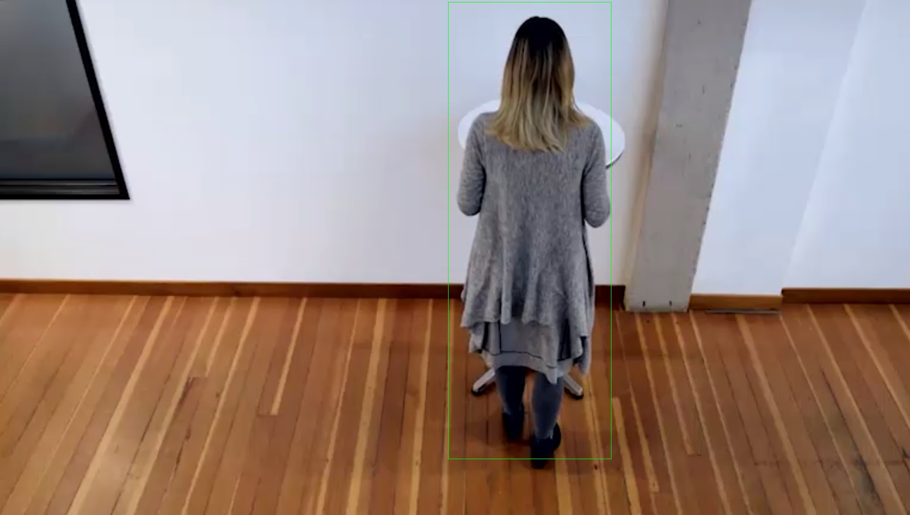
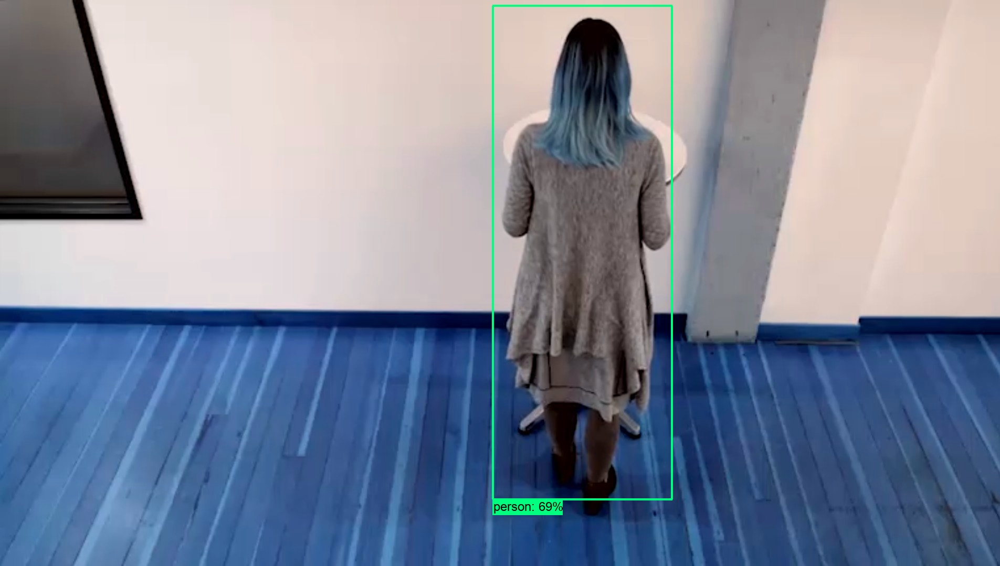

# Project Write-Up

In this project, you will utilize the Intel® Distribution of the OpenVINO™ Toolkit to build a People Counter app, including performing inference on an input video, extracting and analyzing the output data, then sending that data to a server. The model will be deployed on the edge, such that only data on 1) the number of people in the frame, 2) time those people spent in frame, and 3) the total number of people counted are sent to a MQTT server; inference will be done on the local machine.

## Explaining Custom Layers

Custom Layers are useful when required layers are not supported. Therefore, custom layers can be used to replace them, and somehow, obtain what is required. Nonetheless, the use of custom layers should be avoided if other options are available. This, since one of the main advantages provided with the use of OpenVINO can be lost, since the performance of the device that uses the custom layers won't be optimized to be working at the edge. The process to create custom layers depends on the DNN framework used.

## Comparing Model Performance

The methods to compare models before and after the Intermediate Representation conversion was based on the use of OpenVINO model optimizer and the inference engine, and on tensorflow to load and make predictions with the frozen version of the model choosen. The performances to compare where obtained when using as input a specific *jpg* image where a person was present, given as result the following classifications:

#### Classification using the IR model

#### Classification using the frozen TF model

The difference between model accuracy pre- and post-conversion was ***0.01509053***, given that the accuracy of the frozen TensorFlow model was ***0.6973998***, while the accuracy of the optimized model using openvino was ***0.6830927***. Additionally, the required times to make predictions were of ***0.00001526*** and ***0.000001669*** seconds, for the frozen tf model and the IR version, respectively. The better accuracy was expected from the frozen version of the model choosen, while at the same time the faster response making predictions with the IR model was also expected, given that it is optimized to be used on edge decives. 

Cloud computing is another metric that can be used to compare the performance of a device working at the edge. Cloud computing is the opposite of edge computing, it has all the advantages of local processing and processing at the edge, meaning, the speed and the presence of more than enough resources to get the full potential of models. Nevertheless, there also exist limitations, which is costs and delays related to sending data to the cloud to be stored and processed and the required time to take actions based on those predictions; while in edge computing costs are smaller and the speed of reaction is fast.

## Assess Model Use Cases

The potential applications for the presented app can be to determine the traffic of persons around specific locations. This can be translate into bussnines analysis to determine when a store should use more resopurces to sell more accordingly with the amount of people present. This should increase sales while reducing losses related to use of resources. 

Moreover, this types of applications can also be used to reduce energy consumtpion of systems activated by the the proximity of people. For example, a security systems can be working ina saving enery mode, but then in the presence of an unexpected person it can run using all its resoruces to avoud robberies or similar activities. In this way, the security system can have they full performances when required, while saving energy. 

## Assess Effects on End User Needs

There exist different dependencies that can affect the performance of the edge device used to identify persons under different ligth conditions, focal and camera position. If a edge device is implemented considering a speific case, its performance will decrease when those conditions change, since as being a device working at the edge, its generalization is limited. As result, the edge device needs to be implemented while constrained or determining the conditions under which provides a satisfactory performance.

Lighting, model accuracy, and camera focal length/image size have different effects on a
deployed edge model. The potential effects of each of these are as follows:

- Ligthing -> If a model is deployed on an edge device that measures the amount of traffic around specific places, its performance can have peaks and valleys depending on the different lights conditions during the day.

- Camera focal -> The performance of the model deployed on an edge device is also limited with the distance of targets with respect to the sensor used to acquire input signals. Every sensor has a working range and cameras are no different. If the camera is not able to correctly record persons the performance of the edge device will decrease. Therefore, the performance of the device is limited to the distance in which the targets can be sense correctly on a specific input sensor.

- Image size -> The size of the input image is also very important to define the performance of a model deployed on a specific edge device. The size of the image is closely related to its resolution, if the image is big but has low resolution, then the model won't be able to recognize persons on it. The size of the image and its resolution should have the same characteristics as the images used to train the model deployed in the edge device.

- Model accuracy -> As mentioned during the module lectures, the use of the model optimizer reduces the accuracy but increase the speed of the device and reduce the resources used. For that reason, the expected accuracy of an edge device cannot be compared with a full implementation of the same model. However, the use of full models won't necessarily improve the benefits of using an edge device, especially when used with applications similar to the ones mentioned in the previous section.

## Model Research (Rubrics says that three models are required only when a suitable model was not found)

In investigating potential people counter models, I used the following model:

***Model 1: ssd_mobilenet_v2_coco_2018_03_29***
 
 *Source:* http://download.tensorflow.org/models/object_detection/ssd_mobilenet_v2_coco_2018_03_29.tar.gz

 *I converted the model to an Intermediate Representation with the following arguments:*
 
- Script: /opt/intel/openvino/deployment_tools/model_optimizer/mo.py 
- input_model: frozen_inference_graph.pb 
- tensorflow_object_detection_api_pipeline_config: pipeline.config 
- reverse_input_channels 
- tensorflow_use_custom_operations_config: /opt/intel/openvino/deployment_tools/model_optimizer/extensions/front/tf/ssd_v2_support.json

*The model was enough to fulfil the requirements of the project because:*

- The variance of detecting persons is not greater than 1
- The average time of a persons being detected does not varies from more than 2 seconds than the real average time
- The total count of people does not varies more than the allowed limit

*I tried to improve the model for the app by:*

- Changing the threshold values to identify persons. It was found that with a threshold value of 0.554 the model has its best performance to fulfil the requirements of the project.
- To considerate n frames in my code, variable frame_varaince, to smooth the noise while detecting persons. Considering 10 frames was enough to fulfil the requirements of the project. Moreover, using a frame rate of 24 to send the data to the app, the delay in detecting persons for the required statistics is less than the 2 seconds limits.
 
## Commands used

***Command to generate the IR model:***

*python /opt/intel/openvino/deployment_tools/model_optimizer/mo.py --input_model models/frozen_inference_graph.pb --tensorflow_object_detection_api_pipeline_config pipeline.config --reverse_input_channels --tensorflow_use_custom_operations_config /opt/intel/openvino/deployment_tools/model_optimizer/extensions/front/tf/ssd_v2_support.json*

***Command to run the project:***

*python main.py -i resources/Pedestrian_Detect_2_1_1.mp4 -m models/frozen_inference_graph.xml -l /opt/intel/openvino/deployment_tools/inference_engine/lib/intel64/libcpu_extension_sse4.so -d CPU -pt 0.554 -c GREEN | ffmpeg -v warning -f rawvideo -pixel_format bgr24 -video_size 768x432 -framerate 24 -i - http://0.0.0.0:3004/fac.ffm*
